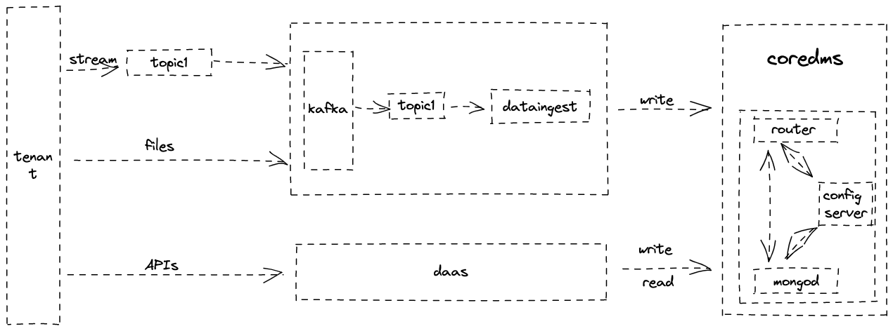

# Part1 Design

## 1.Explain your choice of the application domain and corresponding types of data to be supported and technologies for mysimbdp-coredms. Explain under which situations/assumptions, your platform serves for big data workload (1 point)

The application domain is airbnb dataset and it is business-related customer data. Every data in the data set is self-describing (one-to-many), which is very suitable for using document database. So I choose mongodb as the database. And mongodb has user-friendly documentations to get started quickly.

situations/assumptions: Different cities have different user data sets, and each city has listings files, reviews files, the amount of data for each city depends on the popularity of the city, and the data is uploaded once a day. We expect to have 10+ GBs/day of data to be ingested into our platform. The data set is characterized by multiple files, but the size of each file is not very large.


## 2.Design and explain the interactions among main platform components in your architecture of mysimbdp. Explain which would be the third parties (services/infrastructures) that you do not develop for your platform. (1 point)

The following diagram shows the main components of the big data platform:

- client:
  - call mysimbdp-daas APIs to read/write/ingest data
  - write data to kafka
  - ingest data to mysimbdp-dataingest
- mysimbdp-dataingest:
  - ingest data from external files(sync)
  - ingest data from specific topics(async)
- mysimbdp-coredms: MongoDB to store data
- mysimbdp-daas: provide APIs



The mysimbdp-coredms(MongoDB) is the third party that I do not develop for my platform.

There are several possible interactions between the components.

- `client -> mysimbdp-dataingest`: the client can use mysimbdp-dataingest to push data into mysimbdp-coredms
- `client -> mysimbdp-daas`: the client can use mysimbdp-daas APIs to query data from mysimbdp-coredms or write data into mysimbdp-coredms.
- `mysimbdp-dataingest -> mysimbdp-coredms`: mysimbdp-dataingest can push data into mysimbdp-coredms from external files or kafka topics.
- `mysimbdp-daas -> mysimbdp-coredms`: mysimbdp-daas can query data from mysimbdp-coredms or write data into mysimbdp-coredms.

## 3.Explain a configuration of a cluster of nodes for mysimbdp-coredms so that you prevent a single-point-of-failure problem for mysimbdp-coredms for your tenants (1 point)

I use docker-compose to deploy a sharded MongoDB cluster locally as it is easy to control and manage the number of nodes.


MongoDB cluster components:

- 2 routers(mongos): Provide services for external application access
- 3 config servers(3 members replica set): Store all nodes in the cluster and shard data routing information
- 3 shards(mongod, each shard has 1 master node and 2 secondary nodes): Store data

Replica set ensures the redundancy and reliability of data during production deployment, and ensures that data will not be lost due to single point failure by saving copies on different machines. In other words, it can also improve the reading ability. The user's reading server and writing server are in different places, and different servers provide services for different users, increasing the load of the entire system.

Sharding provides a way to handle high throughput and large data volumes. Using shards reduces the number of requests each shard needs to handle, so by scaling horizontally, the cluster can increase its storage capacity and throughput.

## 4.You decide a pre-defined level of data replication for your tenants/customers. Explain the level of replication in your design, how many nodes are needed in the deployment of mysimbdp-coredms for your choice so that this component can work property (e.g., the system still supports redundancy in the case of a failure of a node) (1 point)

MongoDB supports `write concern` to control the level of replication. It has two
main arguments:

- `w`: The number of nodes that must acknowledge the write operation before the
  write operation returns.
  - "majority": The majority of all voting members. For our case, the replica
    set with 3 voting members, Primary-Secondary-Secondary. The majority of all
    voting members is 2. (n/2+1) The default value is majority from MongoDB 5.0.
  - "number": Requests acknowledgment that the write operation has propagated to
    the specified number of mongod instances.
- `j`: If true, the write operation waits for the data to be written to the
  journal on disk before returning.

In my case, I set `w` to `majority` and `j` to `true`, it keeps data redundancy. However, this will cause performance degradation.

There are 2+3+3*3=14 nodes in the deployment of mysimbdp-coredms as I mentioned in the previous question.

## 5.Explain how would you scale mysimbdp to allow many tenants using mysimbdp-dataingest to push data into mysimbdp (1 point)

There are two ways to scale mysimbdp:
* mysimbdp-dataingest is a script to ingest data into mysimbdp-coredms. We can use it as many times as we want. For example, in `code/performance_test.py`, I simulate multiple users using it concurrently.
* mysimbdp-daas provides APIs for tenants to write data into mysimbdp-coredms. So we can scale mysimbdp by adding more nodes for mysimbdp-daas. APIs are curical for tenants to use mysimbdp. Because tenants can access the data from mysimbdp-coredms without worrying about the details and changes of my platform.


# Part2 Implementation

## 1.Design, implement and explain one example of the data schema/structure for a tenant whose data will be stored into mysimbdp-coredms (1 point)

I choose the Airbnb data as the dataset for this assignment. The data is in json format as follows. At present, all most software supports the json format and it is easy manage and process. I use MongoDB as the mysimbdp-coredms as document-oriented model is flexible schema with flexible content.

```json
{
   "city": "Los Angeles",
   "id": 109,
   "name": "Amazing bright elegant condo park front *UPGRADED*",
   "host_id": 521,
   "host_name": "Paolo",
   "neighbourhood_group": "Other Cities",
   "neighbourhood": "Culver City",
   "latitude": 33.98301,
   "longitude": -118.38607,
   "room_type": "Entire home/apt",
   "price": 115,
   "minimum_nights": 30,
   "number_of_reviews": 2,
   "last_review": "2016-05-15",
   "reviews_per_month": 0.01,
   "calculated_host_listings_count": 1,
   "availability_365": 227,
   "number_of_reviews_ltm": 0,
   "license": ""
 },
```

## 2.Given the data schema/structure of the tenant (Part 2, Point 1), design a strategy for data partitioning/sharding, explain the goal of the strategy (performance, data regulation and/or what), and explain your implementation for data partitioning/sharding together with your design for replication in Part 1, Point 4, in mysimbdp-coredms (1 point)

Inside a single shard server, MongoDB is divided into chunks, each chunk stores partial data inside this shard server. Chunks has two main purposes:
- Splitting: When the chunk size is too large, MongoDB's progress process is to
  divide this chunk into smaller chunks.
- Balancing: In MongoDB, the balancer is to do the transition of chunks. So the
  load of each shard server is balanced. The default chunk size is
  [128M](https://www.mongodb.com/docs/manual/reference/glossary/#std-term-chunk),

I choose the `host_id` field as partition key and use ranged sharding function. Because documents with "close" shard key values are likely to be in the same chunk, it means it can improve the performance of the write by avoiding a large number of random I/O operations. The `host_id` has large Shard Key Cardinality and low Shard Key Frequency. In addition, the `host_id` is non-monothonic. So using ranged sharding function is a good choice.

## 3.Assume that you are the tenant, write a mysimbdp-dataingest that takes data from your selected sources and stores the data into mysimbdp-coredms. Explain what would be the atomic data element/unit to be stored. Explain possible consistency options for writing data in your mysimdbp-dataingest (1 point)

As for the airbnb data, the atomic data element/unit is based on how many documents could be stored in one batch.

As I mentioned in Part 1, Point 4, there are two consistency options for writing.
- "majority": The majority of all voting members. In our case, the replica set with 3 voting members, Primary-Secondary-Secondary. The majority of all voting members is 2 (n/2+1). The default value is majority from MongoDB 5.0.
- "number": Requests acknowledgment that the write operation has propagated to the specified number of mongod instances.

## 4.Given your deployment environment, measure and show the performance (e.g., response time, throughputs, and failure) of the tests for 1,5, 10, .., n of concurrent mysimbdp-dataingest writing data into mysimbdp-coredms with different speeds/velocities together with the change of the number of nodes of mysimbdp-coredms. Indicate any performance differences due to the choice of consistency options (1 point)

According to the first experiment, when the majority is used, the throughputs will be lower and the delay will be longer, because the client needs to wait for the majority number of the replica set to be written successfully before returning. The number of shards in the second experiment is smaller than that in the first experiment, which leads to a smaller probability of data dispersion, so the throughput becomes higher and the delay becomes shorter in the second experiment.

```
The first test is based on 3 shards and each shard has 3 members of replica set.

{w: "majority", j: true}
| users | requests | lines_per_file | lines_all_request | fails | throughputs | avg/s  | min/s | 99%/s  | max/s  |
| ----- | -------- | -------------- | ----------------- | ----- | ----------- | ------ | ----- | ------ | ------ |
| 1     | 2        | 40438          | 1 * 2 * 40438     | 0     | 21189       | 1.91   | 1.87  | 1.94   | 1.95   |
| 5     | 2        | 40438          | 5 * 2 * 40438     | 0     | 6390        | 6.33   | 4.13  | 8.42   | 8.49   |
| 10    | 2        | 40438          | 10 * 2 * 40438    | 0     | 194         | 208.71 | 8.90  | 554.23 | 554.49 |


{w: 1, j: false}
| users | requests | lines_per_file | lines_all_request | fails | throughputs | avg/s | min/s | 99%/s  | max/s  |
| ----- | -------- | -------------- | ----------------- | ----- | ----------- | ----- | ----- | ------ | ------ |
| 1     | 2        | 40438          | 1 * 2 * 40438     | 0     | 21231       | 1.90  | 1.85  | 1.95   | 1.95   |
| 5     | 2        | 40438          | 5 * 2 * 40438     | 0     | 6875        | 5.88  | 4.98  | 7.15   | 7.17   |
| 10    | 2        | 40438          | 10 * 2 * 40438    | 0     | 471         | 85.81 | 7.39  | 247.59 | 247.77 |
```

```
The second test is based on 2 shards and each shard has 3 members of replica set.
{w: "majority", j: true}
| users | requests | lines_per_file | lines_all_request | fails | throughputs | avg/s | min/s | 99%/s | max/s |
| ----- | -------- | -------------- | ----------------- | ----- | ----------- | ----- | ----- | ----- | ----- |
| 1     | 2        | 40438          | 1 * 2 * 40438     | 0     | 22128       | 1.83  | 1.77  | 1.88  | 1.89  |
| 5     | 2        | 40438          | 5 * 2 * 40438     | 0     | 7028        | 5.75  | 3.65  | 7.97  | 7.99  |
| 10    | 2        | 40438          | 10 * 2 * 40438    | 0     | 2128        | 18.99 | 9.59  | 27.39 | 27.46 |

{w: "1", j: false}
| users | requests | lines_per_file | lines_all_request | fails | throughputs | avg/s | min/s | 99%/s | max/s |
| ----- | -------- | -------------- | ----------------- | ----- | ----------- | ----- | ----- | ----- | ----- |
| 1     | 2        | 40438          | 1 * 2 * 40438     | 0     | 22128       | 1.83  | 1.82  | 1.83  | 1.83  |
| 5     | 2        | 40438          | 5 * 2 * 40438     | 0     | 6540        | 6.18  | 3.18  | 8.79  | 8.87  |
| 10    | 2        | 40438          | 10 * 2 * 40438    | 0     | 2414        | 16.74 | 5.80  | 22.01 | 22.13 |
```

## 5.Observing the performance and failure problems when you push a lot of data into mysimbdp-coredms (you do not need to worry about duplicated data in mysimbdp), propose the change of your deployment to avoid such problems (or explain why you do not have any problem with your deployment) (1 point)

1.
When I use `pymongo.insert_many` to insert same documents multiple times, the application will raise `BulkWriteError` with `DuplicateKeyError` due to `_id` field. Based on my previous experience, the `_id` field will be filled by
mongodb automatically. It would be impossible to duplicate `_id` field. However, when I check the `pymongo`
[documentation](https://pymongo.readthedocs.io/en/stable/faq.html#writes-and-ids), I found that the `_id` field can be filled by this library automatically. So I need deep copy the documents before inserting them into mongodb.

2.
When I use `{w: "majority", j: true}` to write data into mongodb, after the client finishes, the cpu occupancy rate of mongodb is still high. I am testing  locally (MacOS), docker is running in a virtual machine, and the entire CPU occupancy rate continues to be (400%/800%). It is beacuse replication still happens background. And the `config servers` and `mongod`are down because of no space left on device. There are 2 ways to solve this problem. The first way is to VM disk size runing the docker on my Mac. The second way is to reduce the data size. I choose the second way. As I am testing locally, I don't want to increase the disk size.

```
➜  code git:(master) ✗ docker compose ps
NAME                COMMAND                  SERVICE             STATUS              PORTS         
mongo-config-01     "docker-entrypoint.s…"   configsvr01         restarting          
mongo-config-02     "docker-entrypoint.s…"   configsvr02         restarting          
mongo-config-03     "docker-entrypoint.s…"   configsvr03         restarting          
router-01           "docker-entrypoint.s…"   router01            running             0.0.0.0:27117->27017/tcp
router-02           "docker-entrypoint.s…"   router02            running             0.0.0.0:27118->27017/tcp
shard-01-node-a     "docker-entrypoint.s…"   shard01-a           restarting          
shard-01-node-b     "docker-entrypoint.s…"   shard01-b           restarting          
shard-01-node-c     "docker-entrypoint.s…"   shard01-c           restarting          
shard-02-node-a     "docker-entrypoint.s…"   shard02-a           restarting          
shard-02-node-b     "docker-entrypoint.s…"   shard02-b           restarting          
shard-02-node-c     "docker-entrypoint.s…"   shard02-c           restarting          
shard-03-node-a     "docker-entrypoint.s…"   shard03-a           restarting          
shard-03-node-b     "docker-entrypoint.s…"   shard03-b           restarting          
shard-03-node-c     "docker-entrypoint.s…"   shard03-c           running             0.0.0.0:27130->27017/tcp
zoo1                "/etc/confluent/dock…"   zoo1                running             2888/tcp, 0.0.0.0:2181->2181/tcp, 3888/tcp
zoo2                "/etc/confluent/dock…"   zoo2                running             2181/tcp, 2888/tcp, 3888/tcp, 0.0.0.0:2182->2182/tcp
zoo3                "/etc/confluent/dock…"   zoo3                running             2181/tcp, 2888/tcp, 3888/tcp, 0.0.0.0:2183->2183/tcp


➜  code git:(master) ✗ docker compose logs shard01-a | grep error
shard-01-node-a  | {"t":{"$date":"2023-02-08T08:46:02.382+00:00"},"s":"E",  "c":"CONTROL",  "id":20557,   "ctx":"initandlisten","msg":"DBException in initAndListen, terminating","attr":{"error":"FileStreamFailed: Unable to write string 1\n to file: /data/db/mongod.lock No space left on device"}}
shard-01-node-a  | {"t":{"$date":"2023-02-08T08:47:03.836+00:00"},"s":"E",  "c":"WT",       "id":22435,   "ctx":"initandlisten","msg":"WiredTiger error message","attr":{"error":28,"message":{"ts_sec":1675846023,"ts_usec":836199,"thread":"1:0xffffb12b6040","session_dhandle_name":"file:WiredTiger.wt","session_name":"close_ckpt","category":"WT_VERB_DEFAULT","category_id":9,"verbose_level":"ERROR","verbose_level_id":-3,"msg":"__posix_file_write:614:/data/db/WiredTiger.turtle.set: handle-write: pwrite: failed to write 1479 bytes at offset 0","error_str":"No space left on device","error_code":28}}}
```

3.
Sometimes, the `mongos` will raise `ServerSelectionTimeoutError`. It is the
mongodb cluster is in the high load. I extend the timeout time to make it work.

```
pymongo.errors.ServerSelectionTimeoutError: localhost:27117: timed out, Timeout: 30s, Topology Description: <TopologyDescription id: 63e5451cbb4d5e5f03f3b243, topology_type: Sharded, servers: [<ServerDescription ('localhost', 27117) server_type: Unknown, rtt: None, error=NetworkTimeout('localhost:27117: timed out')>]>
```

# Part3 Extension

## 1.Using your mysimdbp-coredms, a single tenant can create many different databases/datasets. Assume that you want to support the tenant to manage metadata about the databases/datasets, what types of metadata you would like to support? Can you provide one example of using the metadata to find a dataset? (1 point)

Assuming I want to find a dataset with tag "tag1", what I can do is to query the metadata with tag "tag1" . Then I check the dataset if it is deleted. If it is not deleted, I check the owner and access_policy to see if I can access the dataset.

```json
{
  "name": "dataset1",
  "description": "dataset1 description",
  "owner": "tenant",
  "tag": ["tag1", "tag2"],
  "created_time": "2023-02-10 00:00:00",
  "updated_time": "2023-02-10 00:00:00",
  "deleted_time": null,
  "size": "100GB",
  "access_policy": ["tenant1:rw", "tenant2:r"]
}
```


## 2.Assume that each of your tenants/users will need a dedicated mysimbdp-coredms. Design the data schema of service information for mysimbdp-coredms that can be published into an existing registry (like ZooKeeper, consul or etcd) so that you can find information about which mysimbdp-coredms is for which tenants/users (1 point)

When a service starts, it needs to register itself to the registry. The service information may includes: current state; ip addresses; configuration and version information; tenants/users information. The registry can do health check towards every service registed. If the service is down, the registry will remove it from the registry. So the registry can provide a list of available services.

When tenants/users want to use mysimbdp, they can find the service information from the registry. Then they can use the service information to connect to mysimbdp.

## 3.Explain how you would change the implementation of mysimbdp-dataingest (in Part 2) to integrate a service discovery feature (no implementation is required) (1 point)

Firstly, when the mysimbdp-coredms starts, it needs to register itself to the service registry (such as connecting to etcd) including some servce information such as ip address. Secondly, when the mysimbdp-dataingest starts, it needs to query the registry to find the ip address of the corresponding mysimbdp-coredms. Then it can connect to mysimbdp-coredms.

## 4.Assume that now only mysimbdp-daas can read and write data into mysimbdp-coredms, how would you change your mysimbdp-dataingest (in Part 2) to work with mysimbdp-daas? (1 point)

The mysimbdp-daas have implemented APIs(/ingestion) to ingest data. So I change the mysimbdp-dataingest to use the APIs to write data into mysimbdp-coredms.

## 5.Assume that you have both mysimbdp-daas and mysimbdp-dataingest available for tenants/users write the data into mysimbdp-coredms. Explain and provide pros and cons of deployment examples suggesting when a tenant/user should use mysimbdp-daas and mysimbdp-dataingest. (1 point)

mysimbdp-daas Pros:
1. Tenants/users can use the APIs to write data into mysimbdp-coredms.
2. We can add more nodes for mysimbdp-daas to provide scalability.
Cons:
1. It is not flexible. Because tenants/users can only use the APIs to write data into mysimbdp-coredms.
2. The tenants/users need to write code to write data into mysimbdp-coredms.


mysimbdp-dataingest Pros:
1. Tenants/users can write data into mysimbdp-coredms by writing code sending data to message brokers or just use this script importing files into mysimbdp-coredms.
2. We can use this script concurrently to provide scalability.
Cons:
1. When tenants/users want to change data structures before using mysimbdp-dataingest, they need to write code.


In my opinion, when Tenants/users have a large amount of data to write into mysimbdp-coredms, they can use mysimbdp-dataingest. When Tenants/users have a small amount of data to write into mysimbdp-coredms, they can use mysimbdp-daas.