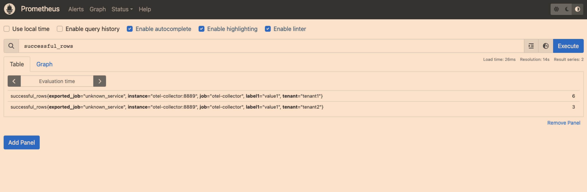

# Part 1 - Batch data ingestion pipeline (weighted factor for grades = 3)


## 1. The ingestion will be applied to files of data. Define a set of constraints for files that mysimbdp will support for ingestion. Design a configuration model for the tenant service profile that can be used to specify a set of constraints for ingestion (e.g., maximum number of files and amount of data). Explain why you as a platform provider decide such constraints. Implement these constraints into simple configuration files and provide examples (e.g., JSON or YAML). (1 point)

As a platform provider, we need to define a set of constraints for files that mysimbdp will support for ingestion to ensure the system's stability, reliability, and security, for example, preventing from DDoS attacks by limiting the number of files and the amount of data.

The tenant service profile is as follows (file_size_limit is in bytes):
```
# constraints_tenant1.json
{
    "file_types":"csv,json",
    "number_of_files_limit":10, 
    "file_size_limit":1048576
}

# constraints_tenant2.json
{
    "file_types":"json",
    "number_of_files_limit":5, 
    "file_size_limit":1048576
}
```


## 2. Each tenant will put the tenant's data files to be ingested into a staging directory, client-staging-input-directory within mysimbdp (the staging directory is managed by the platform). Each tenant provides its ingestion programs/pipelines, clientbatchingestapp, which will take the tenant's files as input, in client-staging-input-directory, and ingest the files into mysimbdp-coredms. Any clientbatchingestapp must perform at least one type of data wrangling to transform data elements in files to another structure for ingestion. As a tenant, explain the design of clientbatchingestapp and provide one implementation. Note that clientbatchingestapp follows the guideline of mysimbdp given in the next Point 3. (1 point)

clientbatchingestapp has the following steps:
* file input: client-staging-input-directory
* data wrangling: from csv to json
* batch insert to mysimbdp-coredms
* output: metrics

## 3. As the mysimbdp provider, design and implement a component mysimbdp-batchingestmanager that invokes tenant's clientbatchingestapp to perform the ingestion for available files in client-staging-input-directory. mysimbdp imposes the model that clientbatchingestapp has to follow but clientbatchingestapp is, in principle, a blackbox to mysimbdp-batchingestmanager. Explain how mysimbdp-batchingestmanager knows the list of clientbatchingestapp and decides/schedules the execution of clientbatchingestapp for tenants. (1 point)


mysimbdp-batchingestmanager has the following steps:
* listen to client-staging-input-directory using `watchdog` library
* if new files are added, there are a few steps
    * retrieve the tenant's name from the file name
    * check the constraints of `constraints_[tenant_name].json` to see if the new files are valid or not
    * if it is valid, invoke clientbatchingestapp using `importlib` library based on file_names; if it is not valid, we move the files to client-staging-input-invalid-directory
    * if invoking clientbatchingestapp is successful, we delete the files; if not, we move the files to client-staging-input-failed-directory
        * here is one possible problem: if we execute the failed file again, how to ensure idempotence
* the batchingestmanager can support various schedule policy
    * first come first serve (default), which is implemented in this assignment. It depends on when the `watchdog` library detects the new files.
    * prority policy based on the `constraints_[tenant_name].json` (not implemented)


## 4. Explain your design for the multi-tenancy model in mysimbdp: which parts of mysimbdp will be shared for all tenants, which parts will be dedicated for individual tenants so that you as a platform provider can add and remove tenants based on the principle of pay-per-use. Develop test clientbatchingestapp, test data, and test constraints of files, and test service profiles for tenants according your deployment. Show the performance of ingestion tests, including failures and exceptions, for at least 2 different tenants in your test environment and constraints. Demonstrate examples in which data will not be ingested due to a violation of constraints. Present and discuss the maximum amount of data per second you can ingest in your tests. (1 point)


The core components such as mysimbdp-coredms, mysimbdp-daas and mysimbdp-batchingestmanager will be shared among all tenants. These components provide the basic data storage and retrieval functionalities that are common to all tenants. 

The ingestion pipeline components such as clientbatchingestapp will be dedicated for individual tenants. Each tenant will have their own clientbatchingestapp and service profile, which specifies the ingestion constraints and configurations specific to that tenant. We can determine whether the current tenant is allowed to execute according to whether the service profile exists

test: In my example, I have two tenants, tenant1 and tenant2. Each tenant has their own clientbatchingestapp and service profile. The service profile of tenant1 allows csv and json files, while the service profile of tenant2 only allows csv files. The service profile of tenant1 allows 10 files and 10MB of data, while the service profile of tenant2 allows 5 files and 10MB of data.

```
python3 mysimbdp-batchingestmanager.py

# test constraints, create 1 json file that is not allowed by tenant2
cp ../data/data.json ./client-staging-input-directory/tenant2-data.json

# you can see log outputed by mysimbdp-batchingestmanager: the json file is not allowed by tenant2. And the file is moved to client-staging-input-invalid-directory


# test constraints, create 11 csv files that exceed the number of files limit of tenant1
cp ../data/data.csv ./client-staging-input-directory/tenant1-data.csv
......
cp ../data/data.csv ./client-staging-input-directory/tenant1-data10.csv
cp ../data/data.csv ./client-staging-input-directory/tenant1-data11.csv
# you can see log outputed by mysimbdp-batchingestmanager: tenant1 file tenant1-data1.csv count 11 exceeded! And the files are moved to client-staging-input-invalid-directory


# test constraints, the file size of tenant1-data.csv is 14MB, which exceeds the file size limit of tenant1
cp ../data/big_file.csv ./client-staging-input-directory/tenant1-data.csv
# you can see log outputed by mysimbdp-batchingestmanager: tenant1 file tenant1-data.csv size exceeded! And the file is moved to client-staging-input-invalid-directory
```


performance
* qps: bytes / time; 
* success rows: number of rows that are successfully ingested
* failed rows: number of rows that are failed to be ingested
```
python3 mysimbdp-batchingestmanager.py

bash performance_batch.sh

# you can see the qps outputed by mysimbdp-batchingestmanager or you can see the metrics on Prometheus `localhost:9090`
Tenant: tenant1 QPS: 3872414.512221419 Time 19.120267152786255 Successful Rows: 404380 Failed Rows: 0
```

## 5. Implement and provide logging features for capturing successful/failed ingestion as well as metrics about ingestion time, data size, etc., for files which have been ingested into mysimbdp. Logging information must be stored in separate files, databases or a monitoring system for analytics of ingestion. Explain how mysimbdp could use such logging information. Show and explain simple statistical data extracted from logs for individual tenants and for the whole platform with your tests. (1 point)

clientbatchingestapp has the following functions:
* metrics
    * ingestion_time: time from the start of ingestion to the end of ingestion
    * data_size: size of the file in bytes
    * ingestion_type: batch
    * ingestion_rate: data_size/ingestion_time
    * sucessful_rows: number of rows that are successfully ingested
    * failed_rows: number of rows that are failed to be ingested
    * tenant_name: name of the tenant
    * timestamp: timestamp of the ingestion
* log: print metrics to stdout and write to separate log files


We can write shell script to extract data from log files and analyze the data, for example: `bash analyze_log.sh`. The script is to analyze sucessful_rows.
* total number of successful/failed files ingested per tenant
* total data size ingested per tenant
* Average ingestion time per tenant
* total number of successful/failed ingests for the whole platform

In addition, I also use OpenTelemetry to expose metrics to the Prometheus monitoring systems. In my implementation, I ejected the metrics to the OpenTelemetry collector and the collector will send the metrics to Prometheus. I can use Promql to query the metrics. For example, I can query the total number of successful files ingested per tenant by using the following Promql query `successful_rows`. Or you can use [built-in aggration functions](https://prometheus.io/docs/prometheus/latest/querying/operators/#aggregation-operators) such as `sum` to aggregate the metrics, such as `sum(successful_rows)`. The next step is to visualize the metrics using Grafana, but I hvae not implemented it yet.


# Part 2 - Near-realtime data ingestion (weighted factor for grades = 3)

## 1. Tenants will put their data into messages and send the messages to a messaging system, mysimbdp- messagingsystem (provisioned by mysimbdp) and tenants will develop ingestion programs, clientstreamingestapp, which read data from the messaging system and ingest the data into mysimbdp-coredms. For near-realtime ingestion, explain your design for the multi-tenancy model in mysimbdp: which parts of the mysimbdp will be shared for all tenants, which parts will be dedicated for individual tenants so that mysimbdp can add and remove tenants based on the principle of pay-per-use. (1 point)

Shared components: mysimbdp-corestream is responsible for managing and storing the stream data that is being ingested from different tenants. And  mysimbdp-streamingestmanager is responsible for managing the clientstreamingestapp instances.

Dedicated components: Each tenant will have its own clientstreamingestapp which will read data from the messaging system and ingest it into mysimbdp-coredms. The clientstreamingestapp will be designed and implemented by each tenant to meet their specific data ingestion requirements. 

So we can add and remove tenants based on the principle of pay-per-use. When a new tenant is added, we can create a new topic for this tenant in mysimbdp-streamingestmanager. When a tenant is removed, we can delete the topic of this tenant in the messaging system.

## 2. Design and implement a component mysimbdp-streamingestmanager, which can start and stop clientstreamingestapp instances on-demand. mysimbdp imposes the model that clientstreamingestapp has to follow so that mysimbdp-streamingestmanager can invoke clientstreamingestapp as a blackbox, explain the model. (1 point)

mysimbdp-streamingestmanager has the following steps:
* create topics for each tenant so we can decide whether this tenant is allowed to execute near-realtime data ingestion according to whether the topics exists
* start the clientstreamingestapp instances using `subprocess` library at the beginning of the program
* reveive the alert report from mysimbdp-streamingestmonitor and take appropriate actions to address the problem, for example, when the avg_ingestion_time is less than a threshold, we delete one instance of clientstreamingestapp and when the avg_ingestion_time is greater than a threshold, we add one instance of clientstreamingestapp.

## 3. Develop test ingestion programs (clientstreamingestapp), which must include one type of data wrangling (transforming the received message to a new structure). Show the performance of ingestion tests, including failures and exceptions, for at least 2 different tenants in your test environment, explain also the data used for testing. What is the maximum throughput of the ingestion in your tests? (1 point)

clientstreamingestapp has the following steps:
* receive data from the messaging system, topic_name: "{tenant_name}_{topic_name}"
* data wrangling: transform the received message to json format
* insert data into mysimbdp-coredms
* report metrics to mysimbdp-streamingestmonitor, topic_name: "{tenant_name}_{topic_name}_report"


In my performance test, I write the `performace_stream.py` script to simulate 2 tenants sending data to the message system. And the `streamingestmonitor.py` will output the metrics to the stdout and restore it in `logs/streamingmonitor.log` including the qps.
```
python3 mysimbdp-streamingestmanager.py
python3 mysimbdp-streamingestmonitor.py

python3 performance_stream.py # it takes about 3 minutes to finish the test

# output in the `logs/streamingmonitor.log` or streamingestmonitor stdout
Consumer streamingestmonitor consume data: {"total_messages": 40438, "ingestion_time": 0.004021883010864258, "avg_ingestion_time": 0.006804317311119436, "ingestion_type": "streaming", "ingestion_rate": 138740.98239374, "data_size": 558, "total_data_size": 21538399, "qps": 78277.90464685457, "tenant_name": "tenant1", "timestamp": "2023-03-09 23:35:02.292879", "predefined_time": 10} from topic tenant1_test_report
```

## 4. clientstreamingestapp decides to report the its processing rate, including average ingestion time, total ingestion data size, and number of messages to mysimbdp-streamingestmonitor within a pre-defined period of time. Design the report format and explain possible components, flows and the mechanism for reporting. (1 point)

Metrics are as follows:
* "total_messages": the total number of messages ingested
* "ingestion_time": the total time taken to ingest all messages, in seconds
* "avg_ingestion_time": the average time taken to ingest a single message
* "ingestion_type": streaming
* "ingestion_rate": the ingestion rate, in bytes/second
* "data_size": the size of the ingested data, in bytes
* "total_data_size": the total size of the ingested data, in bytes
* "qps": total_msg_size / time_consumed,
* "tenant_name": the name of the tenant
* "timestamp": the timestamp of the report
* "predefined_time": the interval of the report, in seconds

Clientstreamingestapp will report the metrics to mysimbdp-streamingestmonitor using Kafka producer. The topic name is "{tenant_name}_{topic_name}_report".


## 5. Implement a feature in mysimbdp-streamingestmonitor to receive the report from clientstreamingestapp. Based on the report from clientstreamingestapp, when the performance is below a threshold, e.g., average ingestion time is too low, mysimbdp-streamingestmonitor decides to inform mysimbdp-streamingestmanager about the situation. Implementation a feature in mysimbdp-streamingestmanager to receive information informed by mysimbdp-streamingestmonitor. (1 point)

mysimbdp-streamingestmonitor has the following steps:
* receive the report clientstreamingestapp in the topic "{tenant_name}_{topic_name}_report"
* analyzes it to determine if the performance is below a certain threshold. 
* If the performance is below the threshold, mysimbdp-streamingestmonitor would send a message to mysimbdp-streamingestmanager to delete one clientstreamingestapp instance and if not, it would send a message to add one clientstreamingestapp instance. The topic name is {tenant_name}_{topic_name}_alert"

# Part 3 - Integration and Extension (weighted factor for grades = 1)

## 1. Produce an integrated architecture for the logging and monitoring of both batch and near-realtime ingestion features (Part 1, Point 5 and Part 2, Points 4-5) so that you as a platform provider could know the amount of data ingested and existing errors/performance for individual tenants. (1 point)

The integrated architecture for logging and monitoring of both batch and near-realtime ingestion features could include the following components:
* Logging: A centralized logging system, such as ELK stack (Elasticsearch, Logstash, Kibana), can be used to capture logs from all components involved in batch and near-realtime ingestion. 
* Metrics: A metrics system, such as Prometheus, can be used to collect and store time-series data about the ingestion process.
* Monitoring: A monitoring system, such as Grafana, can be used to visualize and analyze the logging and metrics data. Dashboards can be created to show the ingestion performance for individual tenants.
* Integration: Each component should be configured to send logs and metrics to the centralized logging and metrics systems in batch and near-realtime ingestion.

I have implemented this feature, the architecture is as follows:
```
+---------------+
|  batchmanager |
+---------------+      +---------------+
                +------>               |    +-------------------+
                +------>  collector    +---->   prometheus      |
+---------------+      |               |    +-------------------+
|  streaminitor |      +---------------+
+---------------+
```

## 2. In the stream ingestion pipeline, assume that a tenant has to ingest the same data but to different sinks, e.g., mybdp-coredms for storage and a new mybdp-streamdataprocessing component, what features/solutions you can provide and recommend to your tenant? (1 point)


To support this scenario more efficiently, mysimbdp could provide a pipeline architecture that allows the same data to be ingested to multiple sinks simultaneously, with each sink having its own dedicated processing pipeline. The tenant can then configure their clientstreamingestapp to send the ingested data to different topics. We set up a new service, mysimbdp-sinkrouter, to receive the ingested data from the clientstreamingestapp and each topic can be routed to different sinks.


## 3. The tenant wants to protect the data during the ingestion by using some encryption mechanisms to encrypt data in files. Thus, clientbatchingestapp has to deal with encrypted data. Which features/solutions you recommend the tenants and which services you might support them for this goal? (1 point)

To support the tenant's goal of encrypting their data during ingestion, mysimbdp can offer the following solutions:

* Data encryption at the source: The tenant can encrypt the data at the source, i.e., before sending it to mysimbdp. This can be done using various encryption tools and libraries such as OpenSSL. The tenant can then provide mysimbdp with the necessary keys and decryption tools to access the data.

* Encryption during transmission: mysimbdp can support the tenant's goal by providing a secure transmission channel for the encrypted data. This can be achieved by using secure protocols such as HTTPS, SFTP, or other secure file transfer protocols. This will ensure that the data remains encrypted during transmission.

* Encryption at rest: mysimbdp can provide encryption at rest for the tenant's data. This means that the data is encrypted when stored on the mysimbdp platform. This can be achieved by using various encryption techniques such as disk encryption, database encryption, or file-level encryption. mysimbdp can provide the necessary encryption tools and keys to the tenant to ensure that their data remains secure.

* Key management: mysimbdp can also provide key management services to the tenant. This includes the generation, storage, and rotation of encryption keys used to encrypt and decrypt the tenant's data.

* Audit logging: To ensure the security of the tenant's data, mysimbdp can provide audit logging services to track and monitor access to the encrypted data. This includes logging of key usage, decryption requests, and access attempts to the encrypted data.

By offering these features and solutions, mysimbdp can help the tenant protect their data during ingestion and ensure that their data remains secure while being processed and stored on the platform.

## 4. In the case of near-realtime ingestion, we want to (i) detect the quality of data to allow ingestion only for data with a pre-defined quality of data condition and (ii) store metadata, including detected quality, into the platform, how would you suggest a design/change of your design for achieving this? (1 point)

To achieve quality data detection and metadata storage during near-realtime ingestion, the following design changes can be made to the existing architecture:

* Add a quality control component: A new component, named mysimbdp-qualitycontrol, can be added to the architecture between the teant and the clientstreamingestapp. The role of this component is to perform data quality checks on incoming messages and decide whether to ingest them or not based on predefined quality criteria. If the message passes the quality checks, it will be forwarded to the clientstreamingestapp for further processing. If the message fails the quality checks, it will be discarded.

* Define quality criteria: The tenant needs to define quality criteria, such as data size, data format etc. The mysimbdp-qualitycontrol component will use these criteria to determine whether to accept or reject an incoming message.

* Add a metadata store: A new metadata store, named mysimbdp-metadatastore, can be added to the architecture. The mysimbdp-qualitycontrol component will send quality metadata to mysimbdp-metadatastore for each message that is accepted. mysimbdp-metadatastore can store this metadata in mysimbdp-coredms for further analysis and reporting.

* Integrate with mysimbdp-streamingestmonitor: The mysimbdp-qualitycontrol component also sends data qulity to mysimbdp-streamingestmonitor for monitoring.


## 5. If a tenant has multiple clientbatchingestapp, each is suitable for a type of data and has different workloads, such as complex transformation or feature engineering (e.g., different CPUs, memory consumption and execution time), how would you extend your design and implementation in Part 1 (only explain the concept/design) to support this requirement? (1 point)

To support multiple clientbatchingestapp instances with different workloads, we can introduce a load balancing component into our design. Each clientbatchingestapp instance can register with the load balancing component to indicate its available resources and workload capacity. When data arrives, the load balancing component will determine which instance in mysimbdp to deal with the data based on factors such as current workload. It means that mysimbdp is a distributed system that has multiple instances to run clientbatchingestapp.
